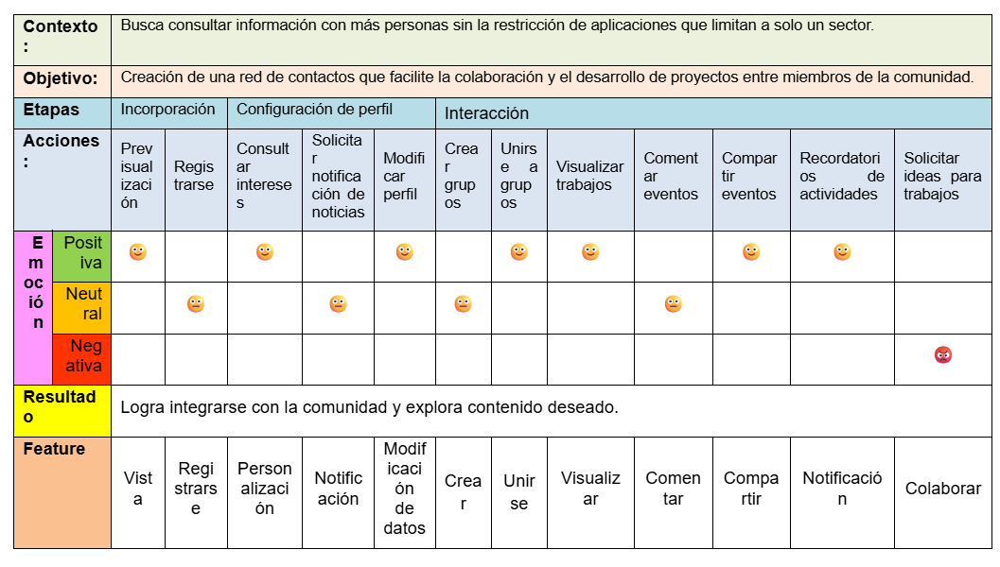
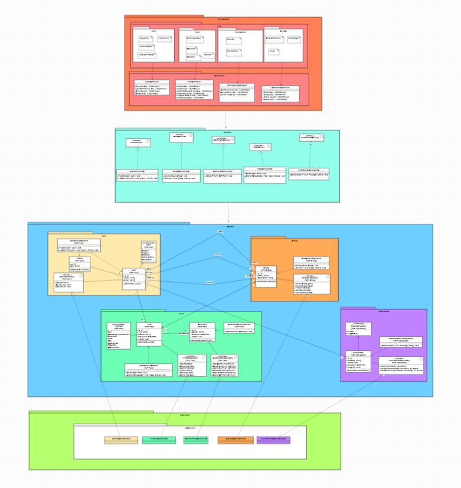

# UNSA.Connect.Domain

Core **domain** logic for **UNSA.Connect**, a Reddit-style platform to centralize **news**, **events**, **scholarships**, **services** and **discussions** for the UNSA community. Built with C# and .NET following **Domain-Driven Design** principles.

---

## 🎯 Purpose

Enable **students**, **faculty**, **alumni**, **administrators** and **researchers** at UNSA to:
- Share and discover **official news** and **bulletins**  
- Coordinate and attend **campus events** (talks, workshops, congresses)  
- Find and apply to **scholarship** calls  
- Access key **university services** (libraries, labs, admin processes)  
- Engage in **forum-style discussions** and **group collaborations**

---

## 🚀 High-Level Features & Use Cases



| Actor        | Use Case                              |
|--------------|---------------------------------------|
| Visitor      | Browse public news & events           |
| Student      | Register, Customize Profile, View Posts & Works |
| Faculty      | Publish Announcements, Comment, Share |
| Alumni       | Join Groups, Request Ideas            |
| Administrator| Manage Users & Content                |
| Researcher   | Create Research Groups, Share Findings|

> **Prototype / GUI**  
> View our interactive Figma prototype:  
> [https://www.figma.com/file/XXXXX/unsa-connect-prototype](https://www.figma.com/design/cyspGkz0LOdwwIw2VNx517/UNSAlink?node-id=0-1&t=4jBZSs2lIdbaE7Yt-1)

---

## 📐 Domain Model



**Modules & Aggregates**  
- **Domain.Models**  
  - **User** (`Id, Name, Email, Profile, Role`)  
  - **Profile** (`Id, Bio, AvatarUrl, Preferences`)  
  - **Post** (`Id, Title, Content, CreatedAt, PostType, Author, Group, Comments`)  
  - **Comment** (`Id, Content, CreatedAt, Author, Post`)  
  - **Group** (`Id, Name, Description, CreatedAt, Members, Posts`)  
  - **Notification** (`Id, Type, SourceId, Message, IsRead, CreatedAt, Recipient`)  
- **Domain.Enums**  
  - `Role { Student, Faculty, Alumni, Administrative, Researcher }`  
  - `PostType { News, Event, Scholarship, Service, Discussion }`  
  - `NotificationType { NewPost, NewComment, GroupInvitation, EventUpdate }`  
- **Domain.Events**  
  - `UserRegisteredEvent`, `PostCreatedEvent`, `CommentAddedEvent`, `GroupCreatedEvent`, `NotificationSentEvent`  
- **Domain.Repositories**  
  - Interfaces only: `IUserRepository`, `IPostRepository`, `ICommentRepository`, `IGroupRepository`, `INotificationRepository`  
- **Domain.Services**  
  - Business logic beyond a single aggregate: `PostDomainService`, `NotificationDomainService`, etc.  
- **Domain.Factories**  
  - Aggregate creation: `UserFactory`, `PostFactory`, `GroupFactory`, `CommentFactory`, `NotificationFactory`

---

## 🏗️ Architecture Overview


```text
UNSA.Connect
│
├─ Presentation.Controllers
│    └─ UsersController, PostsController, GroupsController, NotificationsController
│
├─ Application
│    ├─ Interfaces       # IUserService, IPostService, IGroupService, INotificationService
│    └─ Services         # UserService, PostService, GroupService, NotificationService
│
├─ Domain
│    ├─ Models           # Entities & Value Objects
│    ├─ Enums            # Role, PostType, NotificationType
│    ├─ Events           # Domain Events
│    ├─ Repositories     # Interfaces
│    ├─ Services         # Domain Services
│    └─ Factories        # Aggregate Factories
│
└─ Infrastructure
     ├─ Persistence      # ApplicationDbContext, EF Core Configurations
     └─ Repositories     # EF Core implementations of IRepository interfaces
