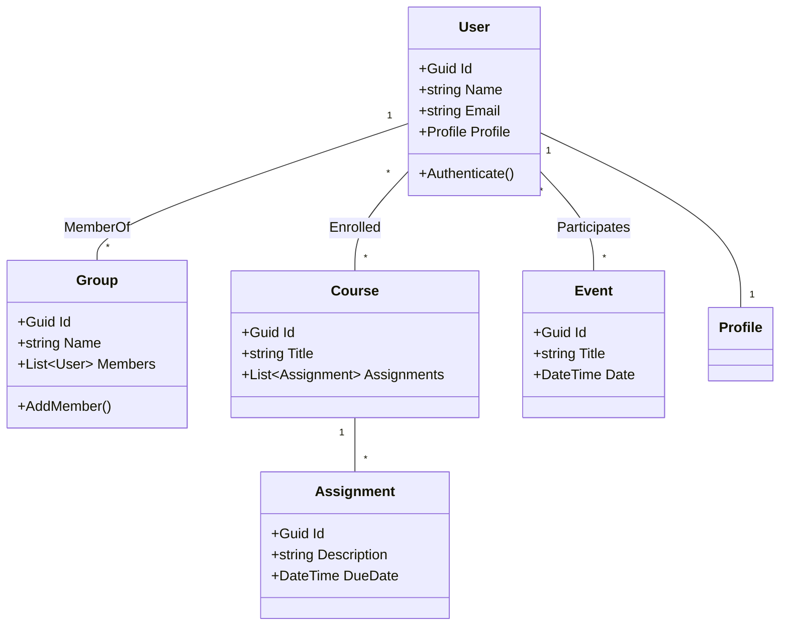

# UNSA.Connect.Domain

Welcome to the **UNSA.Connect.Domain** repository!  
This project is developed by the CSV-Alex team and is organized according to Domain-Driven Design (DDD) best practices, leveraging C# and modern .NET frameworks.

---

## Purpose

The purpose of this repository is to provide the core domain logic for the UNSA.Connect platform. This domain layer encapsulates business rules, entities, value objects, and aggregates that represent the heart of the system, decoupled from infrastructure concerns. Our goal is to enable high scalability, maintainability, and a clear separation of concerns following DDD principles.

---

## Features

### High-Level Functionalities

- **User Management**: Registration, authentication, profile management.
- **Collaboration Tools**: Group creation, messaging, notifications.
- **Academic Modules**: Course enrollment, assignment tracking, grade viewing.
- **Community Engagement**: Event organization, discussion forums.

#### UML Use Case Diagram

```mermaid
usecaseDiagram
  actor User
  actor Admin
  User --> (Register)
  User --> (Login)
  User --> (View Profile)
  User --> (Join Group)
  User --> (Send Message)
  User --> (Enroll in Course)
  User --> (View Assignments)
  User --> (View Grades)
  User --> (Participate in Event)
  Admin --> (Manage Users)
  Admin --> (Manage Courses)
```

### Prototype / GUI

> **Note:** The domain layer is UI-agnostic. GUI and prototypes are implemented in the application and presentation layers.  
> See the main UNSA.Connect repository for frontend prototypes.

---

## Domain Model

### Class Diagram



### Modules

- **User Management**
- **Groups & Collaboration**
- **Academic Domain**
- **Events & Forums**

---

## Architecture Overview

### Package Diagram

```mermaid
packageDiagram
  package "UNSA.Connect.Domain" {
    [Users]
    [Groups]
    [Courses]
    [Assignments]
    [Events]
  }
  [Users] --> [Groups]
  [Users] --> [Courses]
  [Courses] --> [Assignments]
  [Users] --> [Events]
```

### Class Diagram (Sample)

> See the **Domain Model** section above for more details.

---

## Organization

This repository follows strict DDD folder structure:

- `/Entities` - Domain entities (e.g., User, Group, Course)
- `/ValueObjects` - Immutable domain value objects
- `/Aggregates` - Aggregate roots and boundaries
- `/Repositories` - Domain repository interfaces (no infrastructure code)
- `/Services` - Domain services encapsulating business logic
- `/Events` - Domain events

---

## Contribution

Please refer to the [CONTRIBUTING.md](CONTRIBUTING.md) for guidelines on how to contribute to this project.

---

## License

This project is licensed under the MIT License.

---

**CSV-Alex | UNSA.Connect.Domain**  
*Empowering collaborative and academic communities with robust domain logic.*
